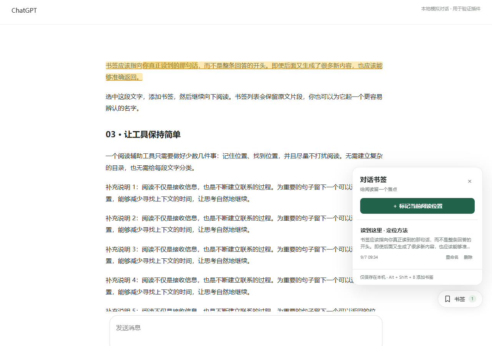

# 对话书签 · ChatGPT

一个简单的 Chrome 插件：在长回答中的具体文字位置添加书签，随时返回继续阅读。

[GitHub 仓库](https://github.com/qxh1555/chatgpt_bookmarks) · 展示页源码位于 `docs/`。

## 安装（无需编译）

1. 在 Chrome 地址栏输入 `chrome://extensions`。
2. 打开右上角的「开发者模式」。
3. 点击「加载已解压的扩展程序」，选择本项目文件夹（包含 `manifest.json` 的那一层）。如果使用压缩包，请先解压。
4. 打开或刷新 ChatGPT 对话页面。右下方出现「书签」按钮即安装成功。

也可从本仓库下载源码压缩包，解压后加载包含 `manifest.json` 的文件夹。

## 使用

- **指定位置**：在一条回答或提问里选中文字，点击旁边出现的「＋ 添加书签」。一次选择应在同一条消息内。
- **标记当前阅读位置**：打开右下方「书签」，点击「＋ 标记当前阅读位置」。未选中文字时，插件记录阅读区域靠近上方的可见文字。
- **快捷添加**：按 `Alt + Shift + B`。有选中文字时记录选区，否则记录当前阅读位置。在消息输入框里不会触发。如果快捷键被系统占用，请用按钮。
- **返回阅读**：打开「书签」，点击列表中的书签。页面跳回原文并短暂高亮，列表自动收起。
- **管理**：每个书签可重命名或删除；不同对话使用独立的书签列表。
- **工具栏入口**：也可以点击 Chrome 工具栏中的插件图标，展开或收起列表。

## 保存方式与适用范围

- 书签通过 `chrome.storage.local` 保存在当前浏览器配置中；刷新、关闭页面或重启浏览器后仍保留。同一浏览器的标签页会同步更新。
- 仅保存书签名称、原文短片段及附近文本、消息标识和对话标识。没有服务器、账号登录、分析统计或网络上传，也不读取 Chrome 的收藏夹。
- 不跨设备同步；卸载扩展会删除其本地数据。临时对话或还没有生成对话地址的新聊天不支持持久书签。
- 支持 `chatgpt.com` 和旧域名 `chat.openai.com`，包括带 `/c/` 的普通、GPT 或项目对话，以及 `/share/` 分享页。分享页和原对话分别保存书签。
- 使用消息标识、原文和前后文定位，不依赖整页滚动像素。新增回答或布局高度变化通常不影响定位。
- 如果早期消息尚未载入，请先向上滚动加载，再点击书签。原文已被删除、修改或切换到另一回答分支时，可能无法定位，会显示提示。
- ChatGPT 网页结构可能更新。当前优先识别 `data-message-author-role` / `data-message-id`，并以对话消息容器作为兼容回退。

## 文件

| 文件 | 用途 |
| --- | --- |
| `manifest.json` | Chrome Manifest V3 配置，仅申请 storage 权限 |
| `content.js` | 书签交互、文本选择、持久保存及跳转 |
| `anchors.js` | 原文与上下文匹配 |
| `background.js` | 工具栏按钮入口 |
| `tests/` | 文本定位测试、浏览器交互测试和模拟长对话 |

没有运行时依赖；直接加载文件夹即可使用。界面使用 Shadow DOM 隔离，不向回答内容插入或包裹节点。

## 验证

安装 Node.js 后运行 `npm test` 和 `npm run check`，分别检查文本定位与脚本语法。

浏览器交互测试使用 Playwright：安装开发依赖 `npm install --no-save playwright` 后，运行 `node tests/browser.test.cjs`。需准备一个支持通过命令行加载扩展的 Chromium / Edge，设置 `BROWSER_EXECUTABLE` 指向其可执行文件；如使用外部 Playwright 安装，可设置 `PLAYWRIGHT_MODULE_PATH`。

新版正式版 Chrome 可以额外设置 `EXTENSION_CDP=1`，测试会在独立临时浏览器中通过调试协议加载扩展。本项目已在本机 Chrome 和 Edge 中加载真实扩展并通过上述交互测试；这是模拟网页验证，不等同于真实 ChatGPT 登录页面验证。

测试使用独立临时配置，拦截所有 ChatGPT 请求并返回本地模拟对话，不打开已有浏览器配置，也不访问真实聊天。覆盖选区跨行内格式、重命名、刷新恢复、内容位移后的跳转、页面内切换对话、跨标签页删除、快捷添加和原文缺失提示。真实登录页的结构兼容性仍需在使用时确认。

## 开发参考

展示页：运行 `npm run build` 生成 `out/`（含可下载的插件 ZIP），运行 `npm run dev` 本地预览。构建不需要安装依赖。仓库附带 GitHub Pages 发布流程；在仓库 Settings → Pages 中将 Source 设为 GitHub Actions 后，推送 main 会更新展示页。

- [Chrome：声明内容脚本](https://developer.chrome.com/docs/extensions/reference/manifest/content-scripts)
- [Chrome：本地扩展存储](https://developer.chrome.com/docs/extensions/reference/api/storage)
- [Chrome：测试时加载未打包扩展的调试协议](https://chromedevtools.github.io/devtools-protocol/tot/Extensions/#method-loadUnpacked)

